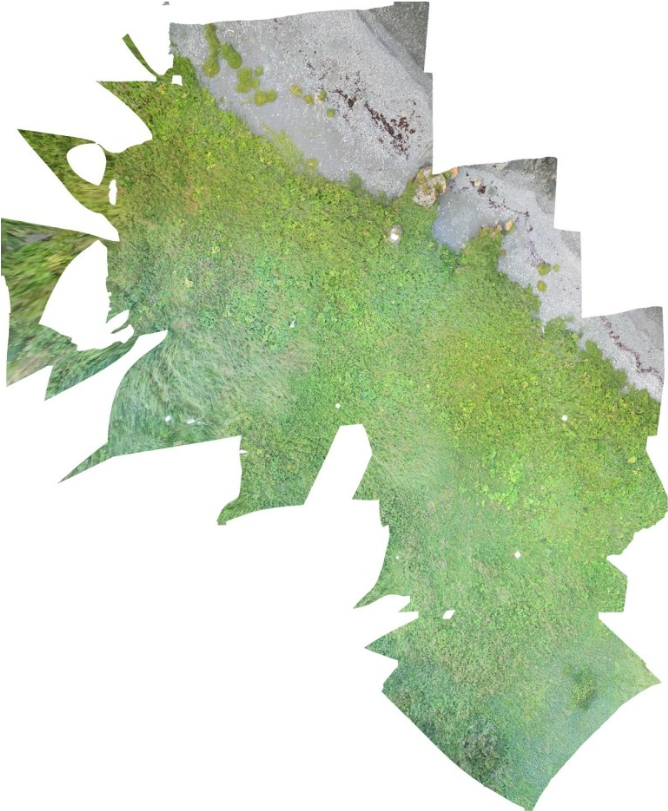

* Amanda Crompton, Marc Bolli
* SMU, MUN
* VM received data stream from  drone in the field. Immediate  photomosaic construction  which feeds back to field work. 
* Used to identify anthropogenic  landscapes
* No website.

{:style="width:350px;position:absolute;left:380px;top:30px;"}

<!--Drones to collect low-elevation aerial data to detect buried historic 
archaeological sites in the coastal regions of Newfoundland.  
https://gazette.mun.ca/research/listening-to-landscapes/. Identify 
anthropogenic landscapes, in which the processes of historic land alteration, 
soil enrichment, and modern vegetation growth create identifiable and 
observable patterns on the modern ground surface today.-->
