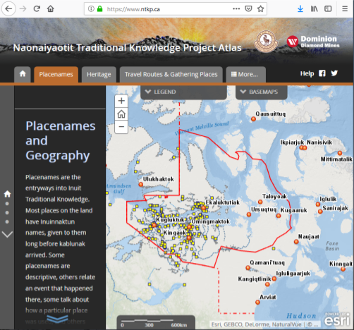

* Dr. Claudio Aporta
* Dalhousie University
* [ntkp.ca](http://www.ntkp.ca)
* Uses [ArcGIS](http://www.esri.com/en-us/arcgis)
* Site on CC cloud\
DB (hosted by [Esri](www.esri.com))

{:style="width:400px;position:absolute;left:330px;top:30px;"}

<!--
multi-media web-based atlas to showcase traditional knowledge of the Inuit Kitikemot
-->