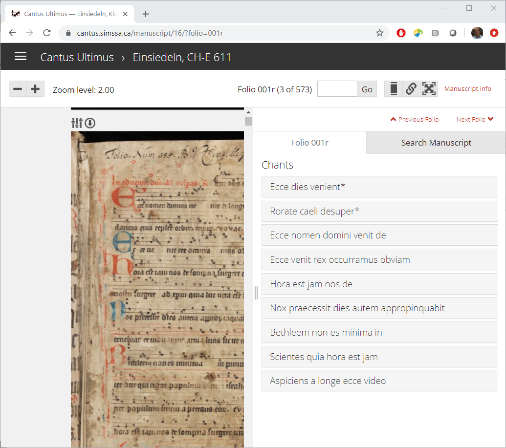

* A large international team
* Local involvement: 
  * Jennifer Bain 
  * Barbara Swanson
* Dalhousie University 
* [cantus.simssa.ca](https://cantus.simssa.ca)
* Technologies used  unknown
{:style="width:400px;position:absolute;left:330px;top:30px;"}

<!--
The main objective of this research is to incorporate the latest optical music 
recognition (OMR) technologies with plainchant manuscripts in order to 
transform the existing CANTUS database into a state-of-the-art research 
environment in which both music and text are fully searchable.
-->
