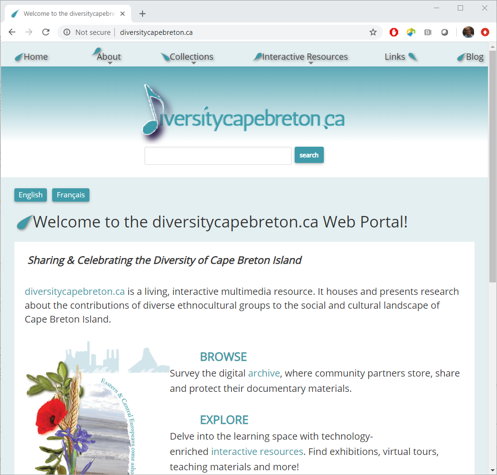

* Dr. Marcia Ostashewski
* Cape Breton University
* [diversitycapebreton.ca](http://diversitycapebreton.ca/)
* Uses [Islandora.ca](https://islandora.ca/)
  * [Drupal](https://www.drupal.org/) CMS
  * [Fedora](https://duraspace.org/fedora/) Repository

{:style="width:400px;position:absolute;left:330px;top:30px;"}