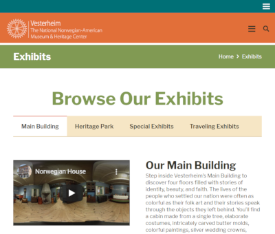
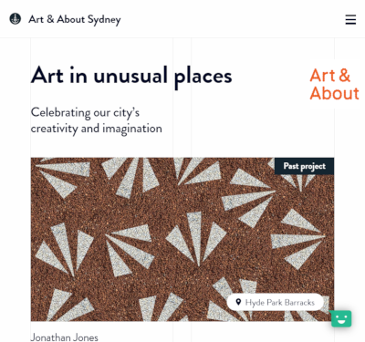

[Jekyll showcase](https://jekyllrb.com/showcase/){:style="width:200px;position:absolute;left:0px;top:90px;"}
[{:style="width:220px;position:absolute;left:0px;top:130px;"}](https://www.foia.gov/)
[{:style="width:220px;position:absolute;left:250px;top:130px;"}](https://vesterheim.org/)
[{:style="width:220px;position:absolute;left:500px;top:130px;"}](https://www.artandabout.com.au/)

