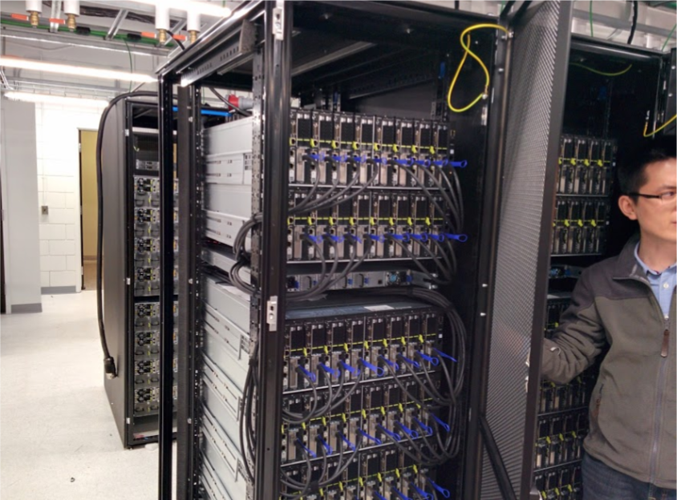

* The word *cloud* has many different meanings
  * Cloud apps: gmail, calendars,  docs etc.
  * Cloud hosting: to host your  websites
  * Cloud infrastructure: cloud  computers
* Physically, a cloud is a bunch of computers that can be access remotely through, apps, and remote connection tools
{{url}}
{{site.url}}
{:style="width:300px;position:absolute;top:30px;left:430px;"}

Compute Canada Cedar cluster
