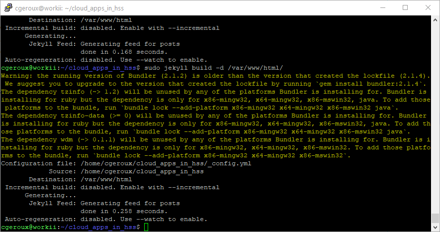
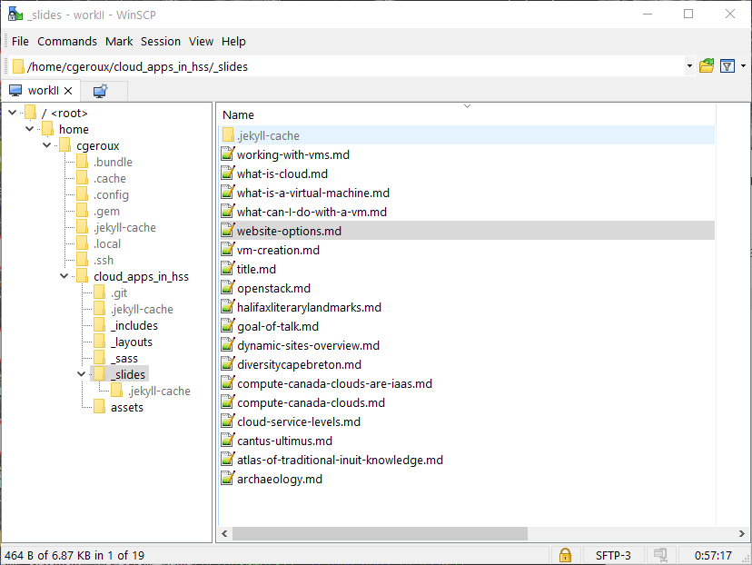

* SSH
  * Commands to configure VM
  * Commands to update VM
* SFTP
  * Transferring/Editing files
* Can have GUI desktops
  * Install desktop (e.g. [MATE](https://mate-desktop.org/))
  * Install [VNC](https://docs.computecanada.ca/wiki/VNC) to allow remote  desktop connections
  
{:style="width:320px;position:absolute;left:400px;top:-60px;"}

{:style="box-shadow: none;width:24px;top:5px;position:relative;"}: [PuTTy](https://www.putty.org/), [MobaXterm](https://mobaxterm.mobatek.net/)
{:style="box-shadow: none;width:24px;top:2px;position:relative;"},{:style="box-shadow: none;width:24px;top:5px;position:relative;"}
: [Terminal](https://www.idownloadblog.com/2019/04/19/ways-open-terminal-mac/)

{:style="width:320px;position:absolute;left:400px;top:170px;"}

{:style="box-shadow: none;width:24px;top:5px;position:relative;"}: [WinSCP](https://www.putty.org/), [MobaXterm](https://mobaxterm.mobatek.net/)
{:style="box-shadow: none;width:24px;top:2px;position:relative;"},{:style="box-shadow: none;width:24px;top:5px;position:relative;"}
: [FileZilla](https://filezilla-project.org/)

